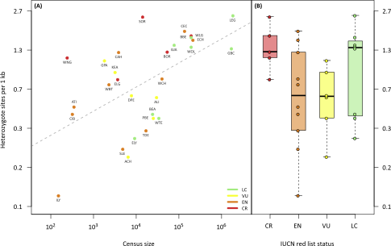

```{r setup, include = FALSE}
library(tidyverse)
library(gganimate)
library(RColorBrewer)
library(knitr)
library(ape)
```

<!-- adding bold and italic options -->
<style>
em {
  font-style: italic
}
strong {
  font-weight: bold;
}
</style>

## Phylogenetics and population genetics lectures

- Key concepts and Single locus phylogenetics
- Multi-locus phylogenetics
- Population structure
- **Conservation genetics**
  - **Theory**
  - **Methods**
  - **Discoveries**

---

## 3rd year module

```{r, out.width = "70%", dpi = 300, echo = FALSE, fig.align = "center"}
  
```

--- .segue .dark 

## Conservation genetics - theory

---

## Conservation genetics

### Applied population genetics for the purpose of conservation

- Identifying management units
- Wildlife crime
- Population/ancestry assignment

### In this lecture we will look at:

- Measuring loss of genetic diversity
  - Caused by drift in small populations
- Measuring inbreeding
  - Caused by mating with close relatives

---

## Loss of genetic diversity

<iframe src = 'https://www.whfreeman.com/BrainHoney/Resource/6716/SitebuilderUploads/Hillis2e/Student%20Resources/Animated%20Tutorials/pol2e_at_1502_genetic_drift_simulation/pol2e_at_1502_genetic_drift_simulation.html' height='600px'></iframe>

---

## Loss of genetic diversity

- At small population sizes this overwhelms the rate of mutation, leading to net loss of diversity

### Inbreeding depression

- Low diversity means recessive alleles of functional genes exposed in an increasingly homozygous state
- Deleterious alleles tend to be recessive
- For some loci, heterozygotes have higher fitness, can also be disrupted

### Reduced evolutionary potential

- Selection acts on variants in the population drivig adaptation
- Unpredictable because we don't know the future precisely (disease, climate change, etc)

--- &twocol

## Example: adders

*** =left

- Population in Sweden
- Isolated > 100 years
- Population decline, deformed/stillborn offspring, low genetic diversity
- inbreeding depression

*** =right

```{r, out.width = "70%", dpi = 300, echo = FALSE, fig.align = "center"}
  include_graphics("./assets/img/adder_female3.JPG")
```

```{r, out.width = "70%", dpi = 300, echo = FALSE, fig.align = "center"}
  include_graphics("./assets/img/adder_male2.JPG")
```

--- &twocol

## Example: adders

*** =left

```{r, out.width = "100%", dpi = 300, echo = FALSE, fig.align = "center"}
  
```

*** =right

### Genetic rescue

- 20 males from other (large) populations released
- Left for 4 years
- Remaining 8 males returned to source population
- Dramatic increase in recruitment
- Increase in genetic diversity
- Reduction in stillborn offspring

---

## Adders background reading

```{r, out.width = "100%", out.height=500, dpi = 300, echo = FALSE}
  include_graphics("./assets/img/Madsen_adders.pdf")
```

--- 

## Inbreeding

- Mating between close relatives
- Not necessarily preferrential
- Becomes unavoidable in small populations
- Basically a form of drift
- Reduces diversity and evolutionary potential
- Effect on genome is more severe, and manifests in a single generation

---

## Inbreeding

```{r, out.width = "100%", dpi = 300, echo = FALSE, fig.align = "center"}
  include_graphics("./assets/img/recom_roh.svg")
```

--- .segue .dark 

## Conservation genetics - methods

---

## Data

### Measuring diversity

- Many methods
- Heterozygosity is simple and often used
- Note across a large number of loci, heterozosity is same for all individuals in a populaiton (HWE)

### Getting data

- Traditionally a small number of markers (e.g. microsatellites) were used
- These would be selected based on being variable in the study population(s)
- Tends to overestimate diversity (circular reasoning)
- Things get unpredictable when applied to other populations/species
- Makes comparisons between species difficult to impossible

---

## Shotgun whole genome sequencing

```{r, out.width = "95%", dpi = 300, echo = FALSE, fig.align='center'}
include_graphics("./assets/img/aDNA_seq.svg")
```

---

## Multispecies comparisons

```{r, out.width = "95%", dpi = 300, echo = FALSE, fig.align='center'}

```

*Barnett et al. 2020. Current Biology*

--- bg:white

## Measuring inbreeding

- In theory can be calculated from know pedigrees (e.g. "pedigree" pets)
- Genetic approaches shown to be much more accurate
- Plus knowledge of pedigree not required
- In particular, genome sequencing allows identification of **runs of homozygosity (ROH)**

```{r, out.width = "95%", fig.width = 8, fig.height = 3, dpi = 300, echo = FALSE, fig.align='center'}
my_roh_hi <- jitter(c(rep(0.0013, times=100)), factor=5)
my_roh_lo <- jitter(c(rep(0.0000000001, times=100)), factor=6)
my_roh <- c(my_roh_hi, my_roh_lo, my_roh_lo, my_roh_hi, my_roh_hi, my_roh_hi, my_roh_lo, my_roh_hi, my_roh_hi, my_roh_hi)

plot(c(1:1000), my_roh, type="l", 
ylim=c(0,0.0015), axes=FALSE, frame.plot=TRUE,
xlab="Chromosome position (Mb)", ylab="Het sites/kb",
main=""
)

axis(1, at=c(0,200,400,600,800,1000), labels=c("0","20","40","60","80","100"), las=1)
axis(2, at=c(0,0.0005,0.001,0.0015), labels=c("0","0.5","1.0","1.5"), las=2)
```

--- .segue .dark 

## Conservation genetics - discoveries

---

## IUCN designation and diversity poorly correlated

```{r, out.width = "95%", dpi = 300, echo = FALSE, fig.align='center'}

```

---

## IUCN designation reading

```{r, out.width = "100%", out.height=500, dpi = 300, echo = FALSE}
  include_graphics("./assets/img/Díez-del-Molino et al. - 2018 - Quantifying Temporal Genomic Erosion in Endangered Species(2).pdf")
```

--- &twocol

## White rhinos (*Ceratotherium simum*)

*** =left

- Two subspecies: northern and southern
- ~20,000 southern white rhinos (in 2015)
- Northern white rhino functionally extinct (2 females left in 2018)

```{r, out.width = "65%", dpi = 300, echo = FALSE, fig.align='center'}
include_graphics("./assets/img/rhin_map.svg")
```

*** =right

```{r, out.width = "60%", dpi = 300, echo = FALSE, fig.align='center'}
include_graphics("./assets/img/1920px-Ceratotherium_simum_(21922261908).jpg")
```

```{r, out.width = "75%", dpi = 300, echo = FALSE, fig.align='center'}
include_graphics("./assets/img/rhin_demo.svg")
```

---

## White rhinos (*Ceratotherium simum*)

```{r, out.width = "100%", dpi = 300, echo = FALSE, fig.align='center'}
include_graphics("./assets/img/rhin_res.svg")
```

---

## White rhinos background reading

```{r, out.width = "100%", out.height=500, dpi = 300, echo = FALSE}
  include_graphics("./assets/img/Sánchez-Barreiro et al. - 2021 - Historical population declines prompted significant genomic erosion in the northern and southern white.pdf")
```

--- &twocol

## Pumas (*Puma concolor*)

*** =left

- Puma/cougar/mountain lion/panther
- Widespread across North and South America
- IUCN listed as least concern
- But some populations are small and isolated
- E.g. Florida panther listed as critically endangered
- 8 females introduced from Texas to reduce inbreeding

*** =right

```{r, out.width = "100%", dpi = 300, echo = FALSE, fig.align='center'}
include_graphics("./assets/img/puma_10.jpg")
```

---

## Pumas (*Puma concolor*)

```{r, out.width = "100%", dpi = 300, echo = FALSE, fig.align='center'}
include_graphics("./assets/img/puma_map.svg")
```


---

## Pumas (*Puma concolor*)

```{r, out.width = "100%", dpi = 300, echo = FALSE, fig.align='center'}
include_graphics("./assets/img/puma_roh.svg")
```

---

## Pumas (*Puma concolor*)

```{r, out.width = "100%", dpi = 300, echo = FALSE, fig.align='center'}
include_graphics("./assets/img/puma_gen.svg")
```

---

## Pumas background reading

```{r, out.width = "100%", out.height=500, dpi = 300, echo = FALSE}
  include_graphics("./assets/img/Saremi et al. - 2019 - Puma genomes from North and South America provide insights into the genomic consequences of inbreeding.pdf")
```

--- &twocol

## Isle Royale wolves

*** =left

- Colonised 2-3 wolves in 1940s
- Expanded to 50 individuals
- Crashed to 14 individuals in 1908s
- Notable improvement 1997 with migration of a single male, followed by second crash
- Moose increased in this period
- 2 wolves left in 2018: father-daughter and half sibs

*** =right

```{r, out.width = "85%", dpi = 300, echo = FALSE, fig.align='center'}

```

```{r, out.width = "85%", dpi = 300, echo = FALSE, fig.align='center'}
include_graphics("./assets/img/islenpmap.webp")
```

---

## Isle Royale wolves

```{r, out.width = "90%", dpi = 300, echo = FALSE, fig.align='center'}
include_graphics("./assets/img/irwolf.svg")
```

--- &twocol

## Sand lizards, UK

*** =left

- UK's rarest lizard
- Highly protected
- Historically widespread in coastal and southern areas
- Extinct in Wales by 1960's
- Multiple reintroductions
- Descendents of Merseyside dune race

*** =right

```{r, out.width = "90%", dpi = 300, echo = FALSE, fig.align='center'}
include_graphics("./assets/img/M_Zauneidechse1_Edit1.jpg")
```

--- .class bg:white

## Mean heterozygosity

```{r, out.width = "70%", fig.width = 4, fig.height = 3.5, dpi = 600, fig.align = "center", echo = FALSE}

my_mean <- read.table("./data/means")

par(mar=c(6,4,1,1))

plot(c(1:16), my_mean$V3, axes=FALSE,
	type="h", lwd=8, col=my_mean$V4,
	ylim=c(0,0.008),
	xlab="", ylab="mean heterozygosity"
)

axis(2, at=c(0,0.002,0.004,0.006,0.008), las=2, cex.axis=0.8)
axis(1, at=c(1:16), labels=my_mean$V2, las=3, cex.axis=0.8)

```

--- .class bg:white

## ROHs source and introduced populations

```{r, out.width = "100%", fig.width = 12, fig.height = 1.7, dpi = 600, fig.align = "center", echo = FALSE}
my_het <- read.table("./data/het", header=TRUE, fill=TRUE)

par(mar=c(2,2,2,1))
    
plot(c(1:114), my_het$e38_mer, main="merseyside", type="h", ylim=c(0,0.015), xlab="", ylab="", col="red")
plot(c(1:114), my_het$iu2_mer, main="merseyside", type="h", ylim=c(0,0.015), xlab="", ylab="", col="red")
plot(c(1:114), my_het$nyj_har, main="harlech", type="h", ylim=c(0,0.015), xlab="", ylab="", col="red")
plot(c(1:114), my_het$X4ya_har, main="harlech", type="h", ylim=c(0,0.015), xlab="", ylab="", col="red")

```

---

## Revision

- lecture material
- Relevant chapters in course textbooks (phylogenetics, population structure and conservation genetics)
- Overview of some of the discussed studies (plus any others you find)
- Example exam questions to follow

--- &thankyou

## Thank you!
