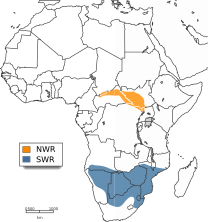
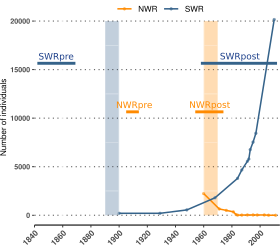
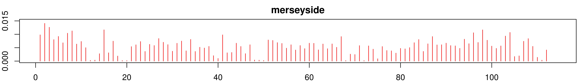

<!-- adding bold and italic options -->

## Phylogenetics and population genetics lectures

- Key concepts and Single locus phylogenetics
- Multi-locus phylogenetics
- Population structure
- **Conservation genetics**
  - **Theory**
  - **Methods**
  - **Discoveries**

---

## 3rd year module

--- .segue .dark 

## Conservation genetics - theory

---

## Conservation genetics

### Applied population genetics for the purpose of conservation

- Identifying management units
- Wildlife crime
- Population/ancestry assignment

### In this lecture we will look at:

- Measuring loss of genetic diversity
  - Caused by drift in small populations
- Measuring inbreeding
  - Caused by mating with close relatives

---

## Loss of genetic diversity

<iframe src = 'https://www.whfreeman.com/BrainHoney/Resource/6716/SitebuilderUploads/Hillis2e/Student%20Resources/Animated%20Tutorials/pol2e_at_1502_genetic_drift_simulation/pol2e_at_1502_genetic_drift_simulation.html' height='600px'></iframe>

---

## Loss of genetic diversity

- At small population sizes this overwhelms the rate of mutation, leading to net loss of diversity

### Inbreeding depression

- Low diversity means recessive alleles of functional genes exposed in an increasingly homozygous state
- Deleterious alleles tend to be recessive
- For some loci, heterozygotes have higher fitness, can also be disrupted

### Reduced evolutionary potential

- Selection acts on variants in the population drivig adaptation
- Unpredictable because we don't know the future precisely (disease, climate change, etc)

--- &twocol

## Example: adders

*** =left

- Population in Sweden
- Isolated > 100 years
- Population decline, deformed/stillborn offspring, low genetic diversity
- inbreeding depression

*** =right

--- &twocol

## Example: adders

*** =left

*** =right

### Genetic rescue

- 20 males from other (large) populations released
- Left for 4 years
- Remaining 8 males returned to source population
- Dramatic increase in recruitment
- Increase in genetic diversity
- Reduction in stillborn offspring

---

## Adders background reading

<embed src="./assets/img/Madsen_adders.pdf" title="plot of chunk unnamed-chunk-5" width="100%" height="500" type="application/pdf" />

--- 

## Inbreeding

- Mating between close relatives
- Not necessarily preferrential
- Becomes unavoidable in small populations
- Basically a form of drift
- Reduces diversity and evolutionary potential
- Effect on genome is more severe, and manifests in a single generation

---

## Inbreeding

--- .segue .dark 

## Conservation genetics - methods

---

## Data

### Measuring diversity

- Many methods
- Heterozygosity is simple and often used
- Note across a large number of loci, heterozosity is same for all individuals in a populaiton (HWE)

### Getting data

- Traditionally a small number of markers (e.g. microsatellites) were used
- These would be selected based on being variable in the study population(s)
- Tends to overestimate diversity (circular reasoning)
- Things get unpredictable when applied to other populations/species
- Makes comparisons between species difficult to impossible

---

## Shotgun whole genome sequencing

---

## Multispecies comparisons

*Barnett et al. 2020. Current Biology*

--- bg:white

## Measuring inbreeding

- In theory can be calculated from know pedigrees (e.g. "pedigree" pets)
- Genetic approaches shown to be much more accurate
- Plus knowledge of pedigree not required
- In particular, genome sequencing allows identification of **runs of homozygosity (ROH)**

--- .segue .dark 

## Conservation genetics - discoveries

---

## IUCN designation and diversity poorly correlated

---

## IUCN designation reading

<embed src="./assets/img/Díez-del-Molino et al. - 2018 - Quantifying Temporal Genomic Erosion in Endangered Species(2).pdf" title="plot of chunk unnamed-chunk-11" width="100%" height="500" type="application/pdf" />

--- &twocol

## White rhinos (*Ceratotherium simum*)

*** =left

- Two subspecies: northern and southern
- ~20,000 southern white rhinos (in 2015)
- Northern white rhino functionally extinct (2 females left in 2018)

*** =right

---

## White rhinos (*Ceratotherium simum*)

---

## White rhinos background reading

<embed src="./assets/img/Sánchez-Barreiro et al. - 2021 - Historical population declines prompted significant genomic erosion in the northern and southern white.pdf" title="plot of chunk unnamed-chunk-16" width="100%" height="500" type="application/pdf" />

--- &twocol

## Pumas (*Puma concolor*)

*** =left

- Puma/cougar/mountain lion/panther
- Widespread across North and South America
- IUCN listed as least concern
- But some populations are small and isolated
- E.g. Florida panther listed as critically endangered
- 8 females introduced from Texas to reduce inbreeding

*** =right

---

## Pumas (*Puma concolor*)

---

## Pumas (*Puma concolor*)

---

## Pumas (*Puma concolor*)

---

## Pumas background reading

<embed src="./assets/img/Saremi et al. - 2019 - Puma genomes from North and South America provide insights into the genomic consequences of inbreeding.pdf" title="plot of chunk unnamed-chunk-21" width="100%" height="500" type="application/pdf" />

--- &twocol

## Isle Royale wolves

*** =left

- Colonised 2-3 wolves in 1940s
- Expanded to 50 individuals
- Crashed to 14 individuals in 1908s
- Notable improvement 1997 with migration of a single male, followed by second crash
- Moose increased in this period
- 2 wolves left in 2018: father-daughter and half sibs

*** =right

---

## Isle Royale wolves

--- 

## Wolf reading

<embed src="./assets/img/sciadv.aau0757.pdf" title="plot of chunk unnamed-chunk-25" width="100%" height="500" type="application/pdf" />

--- &twocol

## Sand lizards, UK

*** =left

- UK's rarest lizard
- Highly protected
- Historically widespread in coastal and southern areas
- Extinct in Wales by 1960's
- Multiple reintroductions
- Descendents of Merseyside dune race

*** =right

--- .class bg:white

## Mean heterozygosity

--- .class bg:white

## ROHs source and introduced populations

---

## Revision

- lecture material
- Relevant chapters in course textbooks (phylogenetics, population structure and conservation genetics)
- Overview of some of the discussed studies (plus any others you find)
- Example exam questions to follow

--- &thankyou

## Thank you!
